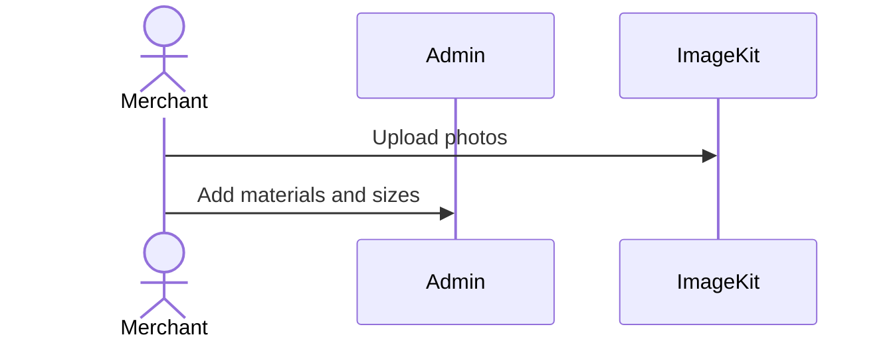
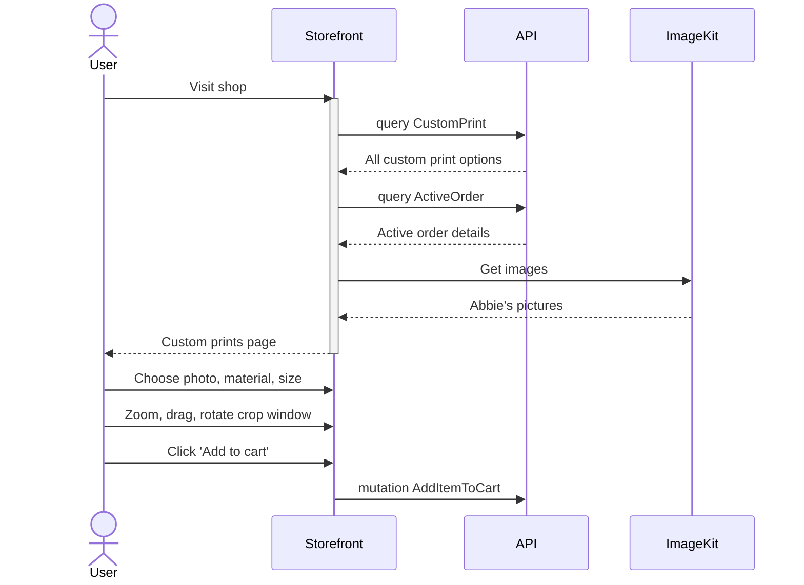
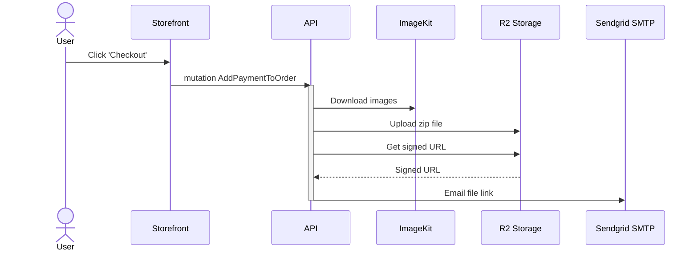

## Merchant adds products

```mermaid
sequenceDiagram
  actor Merchant
  participant Admin
  participant ImageKit
  Merchant->>ImageKit: Upload photos
  Merchant->>Admin: Add materials and sizes
```

## Customer adds items

```mermaid
sequenceDiagram
  actor User
  participant Storefront
  participant API
  participant ImageKit
  User->>Storefront: Visit shop
  activate Storefront
  Storefront->>API: query CustomPrint
  API-->>Storefront: All custom print options
  Storefront->>API: query ActiveOrder
  API-->>Storefront: Active order details
  Storefront->>ImageKit: Get images
  ImageKit-->>Storefront: Abbie's pictures
  Storefront-->>User: Custom prints page
  deactivate Storefront
  User->>Storefront: Choose photo, material, size
  User->>Storefront: Zoom, drag, rotate crop window
  User->>Storefront: Click 'Add to cart'
  Storefront->>API: mutation AddItemToCart
```

## Customer completes order

```mermaid
sequenceDiagram
  actor User
  participant Storefront
  participant API
  participant ImageKit
  participant R2 Storage
  participant Sendgrid SMTP
  User->>Storefront: Click 'Checkout'
  Storefront->>API: mutation AddPaymentToOrder
  activate API
  API->>ImageKit: Download images
  API->>R2 Storage: Upload zip file
  API->>R2 Storage: Get signed URL
  R2 Storage-->>API: Signed URL
  API->>Sendgrid SMTP: Email file link
  deactivate API
```
