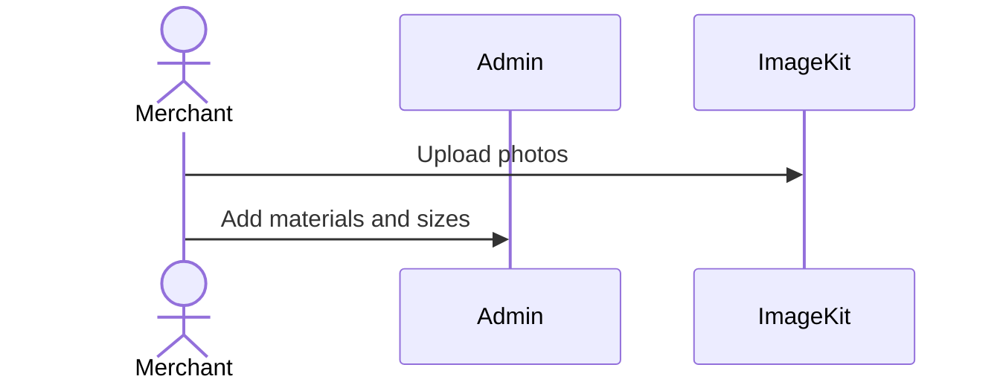
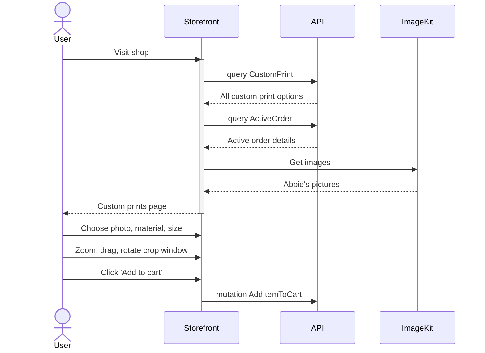
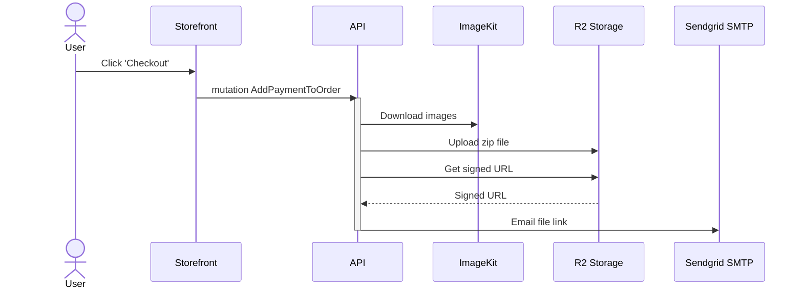

# What is this?

A headless e-comm solution for selling custom prints of photos and digital art. 

This software depends on external solutions for image management, file storage, and email. The former is done with [ImageKit][image-kit]. File storage is configurable with any S3 compatible provider, and email is configurable via SMTP. Changing an environment variable is all that's needed to change out configurable components. 

* [Fly.io][fly] houses the storefront, API, and database
* [Vendure][vendure] provides an extensible, headless e-comm API
* [ImageKit][image-kit] is used for image management, API, and CDN
* [Cloudflare R2][r2] for file storage
* [Sendgrid SMTP Relay][sendgrid-mail] for email

The storefront uses the e-comm API, and both the storefront and the API leverage ImageKit. Customers use the storefront to add cart items consisting of:

* FileID specifying the ImageKit image file
* Transformation params with crop & resize info
* A VariantID which indicates the size and material of the print

When the customer completes the purchase, the API downloads the high-res, transformed images from ImageKit; places the images in a zip file; uploads the zip file to cloud storage; and emails to the merchant a signed URL to the zip file. The merchant takes the file down to the print shop to create the prints, and ships them to the customer.

## Merchant adds products

## Customer adds items

## Customer completes order

[fly]: https://fly.io/
[image-kit]: https://imagekit.io/
[r2]: https://developers.cloudflare.com/r2/
[sendgrid-mail]: https://docs.sendgrid.com/glossary/smtp-relay
[vendure]: https://www.vendure.io/
